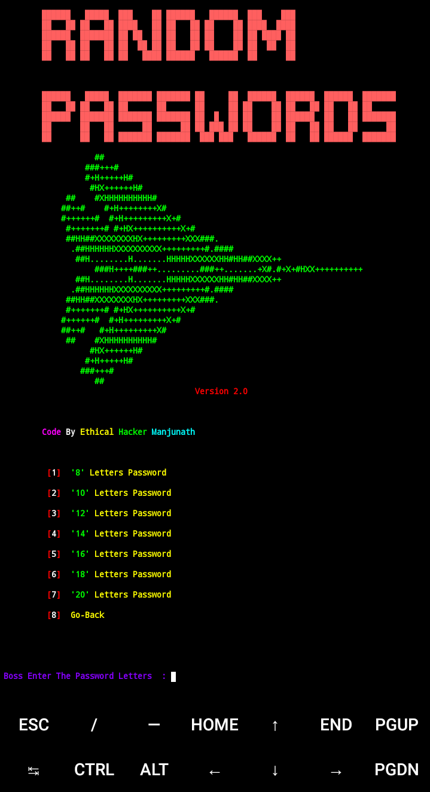

<h1 align="center">Random-Password 🤖</h1>
<b><p align="center">Hi welcome to Random-Passwords Generator 🔥 it Generator New Password and also it's generate special characters password This Tool help Generator strong passwords for users if you want to keep more stronger password use the 18 letter characters password in this tool it's provided</p></b>




<h2>This Tool Test On 👨‍💻</h2>


- ` Ubuntu `
- ` Kali `
- ` Debian `
- ` Termux `


<h2 align="center">🔰 Installation And Requirements 🔰</h2>
 <h3>Ubuntu, Kali, Debian...</h3>

 
```bash
sudo apt-get update
```

```bash
apt-get upgrade -y
```

```bash
apt-get install git -y
```

```bash
git clone https://github.com/Dark-Legends/Random-Password
```

```bash
cd Random-Passwords
```

```bash
chmod +x Random-Passwords.sh
```

```bash
./Random-Passwords.sh
```


<h3 align="center">🔰 Tool Installation On Termux 🔰</h3>

```bash
apt update && apt upgrade -y
```

```bash
apt install git -y
```

```bash
git clone https://github.com/Dark-Legends/Random-Password
```

```bash
cd Random-Passwords
```

```bash
chmod +x Random-Passwords.sh &&. /Random-Password.sh
```


<h3><b><i>📡 Connect with us :</i></b></h3>
<h4>📢 Join Telegram for More Script and Tool for Free and OpenSource</h4>

[](https://t.me/CyberDarkLegends)

[](https://github.com/Dark-Legends)
